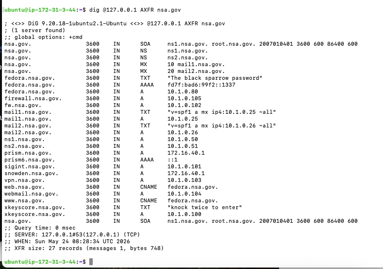

# NS-BIND9

visit org download BIND version whichs you needed (https://launchpad.net/~isc/+archive/ubuntu/bind)

Adding this PPA to your system
You can update your system with unsupported packages from this untrusted PPA by adding ppa:isc/bind to your system's Software Sources. (Read about installing)

sudo add-apt-repository ppa:isc/bind
sudo apt update

sudo cp named.conf.local /etc/bind/
sudo cp db.nsa.gov /etc/bind/
sudo cp named /etc/default/named
# Forces IPv4 only

sudo systemctl restart named

dig @127.0.0.1 AXFR nsa.gov

Output (HTML):

